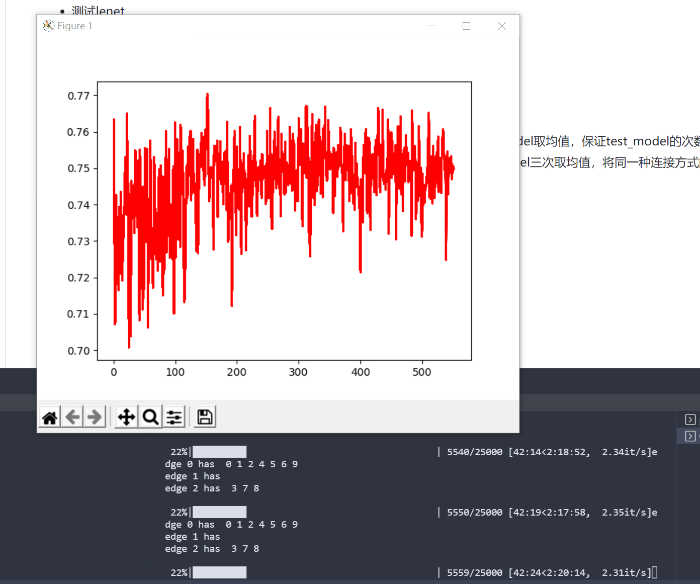
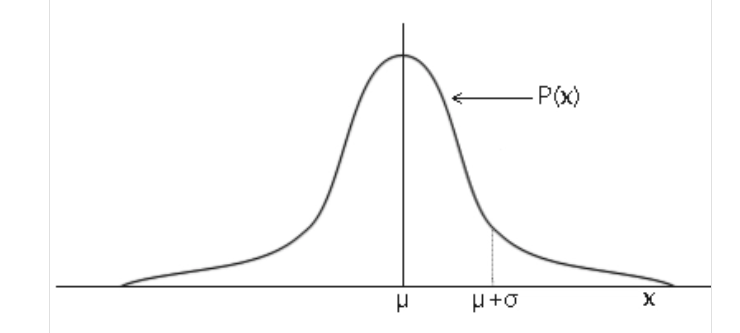

3.23

1. Simple_test action变为=测试效果很好
2. Simple_test2 测试arg
   1. 更新了main正则化那里范围为 0，5（不确定）
   2. 更新了max_action为5
   3. 更改了render的逻辑，t<10 or t%100 == 0看效果
   4. 调试max_ep_step改为7000
   5. 目前测试效果不好
   6. 修改了simple_test2的obs_space 和agent的obs函数，返回一整个state（这就是为什么昨天loss很大）
3. 测试eid_float聚集在每次reset是否良好
   1. 测试结果很好，reset第一轮就很好聚合
4. FL中train中的loss要修改，现在是老版本，修改为昨天的返回edge版，并且注释了
5. 按道理我们的reset中要自己训练一轮，就像昨天那样

argmax：

    ep_step 20   32：31%

    ep_step 10   32：35%

    ep_step 10   128：32.5%

    ep_step 5   32：39%

    ep_step 2   32：> 47.1%

    ep_step 1   32：> 29.1%

    ep_step 2   32  128：> 50.65%

目标:

state：

client_loss * 10+ edge_loss * 10 + cloud_loss

obs:

client_loss  + edge_loss * 10 + [cloud_loss]

reward:

1. 固定轮次

   2.wxy$\sum$U $\Delta$acc

   3. 特写测试

   让每个client接近最大的edge_loss的edge

3.24

原定目标:

* obs函数改到FL
* 增加edge为空情况判断
* 测试lenet
* 帮wxy配好环境
* 归一化(发现loss范围在0-18以内，但目前发现简单改为除以20除以10效果不好)

感觉需要修改:

* reder逻辑，最好改为每多少次的均值，但是会比较慢(test_model次数变多)
  * 目前想到比较中庸的方法是，画两个图，另一个图的值从第一个图每次test_model取均值，保证test_model的次数不变
  * 或者为了保证acc更准确，可以降低速度来保证精度，每回render时，test_model三次取均值，将同一种连接方式的acc标准差变小

目前修改:

* client_loss更改为本地模型测试test数据集
* client观测空edge，edge_loss为client_loss
* 修改max_ep_step为1
* 修改强化学习逻辑为满足batch_size and ep%2 == 0学习一次
* 结果
  

发现问题

* 看似收敛的结果不是最优的a
* 经常不连空edge，但是连上会更优，连上一次之后acc升高但下一次继续选择不连

3.24晚

hyx:   client加epoch，max_ep可以增大  acc就是reward    obs加epoch

jjc:  本地训练次数  + 云训练次数

edge 空时 loss暂定为-1

1 2 2    logistic收敛

3.25

目标:

* 修改dataloader
  * 输入一个列表，表示0-9的数量
* 测试同类异类聚合效果

3.25晚

* client_loss归一化
* 对比random和同类聚合   异类聚合
* 修改数据测试

发现问题:

* 噪声有问题
  * normal函数返回一个以第二参数为标准差，第一参数为均值的正态分布中的一个值，我们的均值为a,范围为[-1,1]，所以标准差应该为0.3(3*$\delta$内是最有可能被选到的)

    
* client_loss确实有问题
  * 目前将loss改为test_model 用train_data   (效果很差)

temp修改：

* 数据修改为大小为200
* edge空时返回0.1

state：

client_loss * 10+ edge_loss * 10 + cloud_loss + eid_float * 10

obs:

client_loss  + edge_loss * 10 + [cloud_loss] + eid_float

+=范围应该增大，因为不连续

actor网络出错

# 4.6

state: client_loss * 10 + w_i * 10

action: +=    （delta_w * 10）

想法:

还是要归一化

最大值-最小值然后归一，这样保证下降和上升不会受0影响

td_error确实在减小

数据分配没有问题

讨论ma会不会好一点
